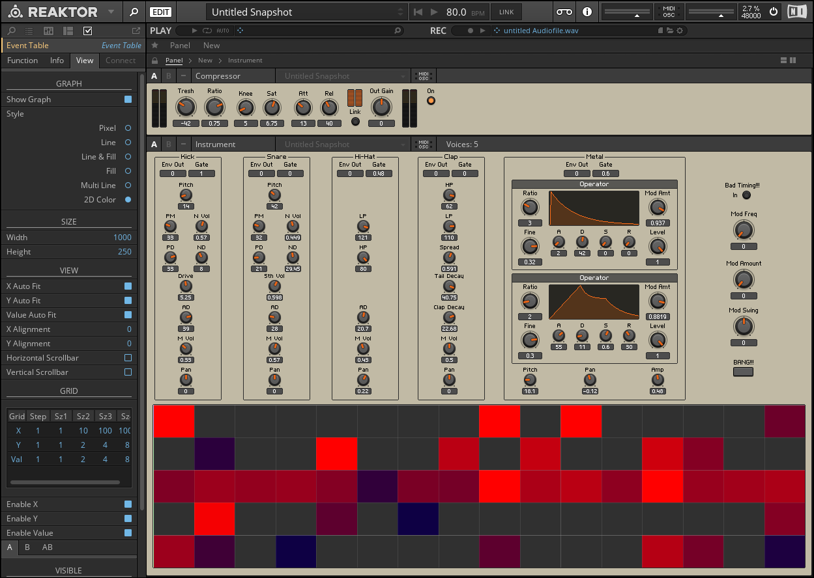

# GrainBeats

A Drum Machine with a Digital Clock Modulation to Create Complex Groovy Rhythm Patterns

**See video demo [here](https://youtu.be/KdxJaFsBaPY).**

-------

## Introduction

The magic part is on the right part of the panel. 

When you turn on the "Bad Timing!!!" button, the digital clock triggering the beats will be modulated corresponding to the parameters below. Plus, you can modify the modulating frequency, modulating amount, and you can even give the modulation a swing.

You can bang the drums directly hit the "BANG!!!" button, it triggers the beats cooperating with modulation. Thus, different sounds would be generated by different parameters.

BTW, **try it hard**, and you will get the best damn groove. 

-------

## Instructions

1. Open GrainBeats.ens in Reaktor (https://www.native-instruments.com/en/products/komplete/synths/reaktor-6/).
2. Press space key or click the start button, and have fun!
3. To change the step shape, first you need to activate edit mode by clicking "EDIT" button on the top. Then click  the step graph below, in the left box click "View", and change the "Style" to "Multi Line" so that you can draw the step bye mouse.
4. To modify the ensemble, first activate edit mode as above, and click "Instrument" to see the routing behind the scene!

